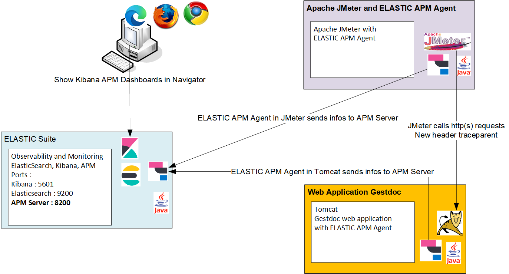

# Article en français pour le blog de https://elastic.co/fr/blog

## Les avantages de ELASTIC APM pour l’observation de l’environnement testé
Mon utilisation de la solution Elastic Application Performance Monitoring (ELASTIC APM) coïncide avec les projets qui sont développés à base de micro-services. C’est-à-dire en 2019 pour les projets sur lesquels j’étais responsable des tests de performance.

À cette époque (2019) est sortie les premières versions de ELASTIC APM.

J’ai été séduit par la facilité d’installation des agents, les nombreux protocoles supportés par l’agent Java (https://www.elastic.co/guide/en/apm/agent/java/current/supported-technologies-details.html) dont l’Apache HttpClient utilisé dans JMeter et aussi d’autres langages (GO, .Net, Node.js, PHP, Python, Ruby), les tableaux de bord de qualité dans Kibana pour la partie APM. 

Je trouvais que les informations affichées dans les tableaux de bord Kibana APM étaient pertinentes et pas trop verbeuses. 

Le monitoring de l’agent Java est simple mais affiche déjà les informations essentielles sur le monitoring de l’OS de la machine et la JVM. 

Le côté open source et la gratuité de la solution pour les fonctions principales de l’outil ont été également déterminantes.

J’ai donc généralisé l’utilisation de la solution ELASTIC APM dans les environnements de performance pour tous les projets. 

Avec ELASTIC APM, je suis en mesure d’avoir les timelines des différents appels et échanges entre les web services, les requêtes SQL exécutées, les échanges de messages par file JMS et du monitoring simple. 

J’ai également accès rapidement aux erreurs ou exceptions levées dans les applications java.

## Pourquoi intégrer ELASTIC APM dans Apache JMeter
En plaçant les agents Java APM sur les applications web, on trouve dans les tableaux de bord Kibana les services appelés, les timelines. Cependant, on reste à un niveau appel API REST principalement, on n’a pas la notion de page.

Par exemple, la page PAGE01 va faire les appels API suivants :
<pre>
/rest/service1
/rest/service2
/rest/service3
</pre>

Une autre page PAGE02 va faire les appels suivants :
<pre>
/rest/service2
/rest/service4
/rest/service5
/rest/service6
</pre>

Une 3ème page PAGE03 va faire les appels suivants :
<pre>
/rest/service1
/rest/service2
/rest/service4
</pre>

On remarque que dans cet exemple le service2 est appelé dans les 3 pages différentes et de le service4 dans 2 pages.

Si on regarde dans le tableau de bord Kibana pour le service2, on va trouver l’union des appels des 3 appels correspondant aux 3 pages mais **on n’a pas la notion de page**.

On ne peut pas répondre à « Dans cette page, quel est le découpage du temps dans les différents appels REST appelés » car pour un utilisateur de l’application la notion de temps de réponse de la page est importante.

Le but de l’outil jmeter-elastic-apm est **d’ajouter la notion de page existant dans JMeter** sous la forme de Transaction Controller et démarrer la partie observabilité dans JMeter en créant une transaction APM et de propager cet identifiant de transaction (traceparent) par l’agent ELASTIC aux appels http REST des web services car l’agent APM reconnait l’Apache httpclient et peut l’instrumenter.

Dans l’appel http, l’agent apm va ajouter dans le header de la requête http l’identifiant de la transaction apm. Les headers ajoutés sont traceparent et elastic-apm-traceparent.

Dans Kibana, les transactions du service jmeter correspondent aux pages des JMeter Transaction Controller. Les transactions associées aux pages sont ici préfixées par « TR_ ».

On part de la notion de page dans JMeter (Transaction Controller) pour aller vers les appels http de l’application Web (gestdoc) hébergée dans Tomcat.

Dans le cas, d’application décomposée en web services, on verra dans la timeline, les différents web services appelés en http(s) ou jms et le temps passé dans chaque web service.

Exemple d’architecture technique pour un test de performance avec Apache JMeter et ELASTIC APM Agent afin de tester une application Web hébergée dans Apache Tomcat.

## Principe de fonctionnent de l’outil jmeter-elastic-apm
Le principe de l’outil jmeter-elastic-apm est d’ajouter du code en groovy avant un JMeter Transaction Controller pour créer une transaction APM avant une page. Puis dans le JMeter Transaction Controller on trouve des Sampler http qui font les appels http(s) REST vers les services, l’agent ELASTIC ajoute automatiquement un nouvel header traceparent contenant l’identifiant de la transaction APM car il reconnait l’Apache HttpClient du sampler http. Puis à l’aide de code groovy de terminer la transaction APM pour indique la fin de la page.

L’outil jmeter-elastic-apm automatise l’ajout du code groovy avant le JMeter Transaction Controller et après le JMeter Transaction Controller.

L’outil jmeter-elastic-apm est disponible en Open source sur le site de Github à l’url :
https://github.com/vdaburon/jmeter-elastic-apm

Ce script JMeter est simple avec 3 pages dans 3 JMeter Transaction Controllers.

Après le lancement de l’outil jmeter-elastic-apm action ADD, les JMeter Transaction Controller sont entourés de code groovy pour créer une transaction APM avant le JMeter Transaction Controller et terminer la transaction APM après le JMeter Transaction Controller.

Dans le sampler « groovy begin apm », le code groovy appelle l’API ElasticApm (version simplifiée):
<pre>
Transaction transaction = ElasticApm.startTransaction();
Scope scope = transaction.activate();
transaction.setName(transactionName); // contient le Nom du JMeter Transaction Controller
</pre>

Dans le sampler « groovy end apm », le code groovy appelle l’API ElasticApm (version simplifiée):
<pre>
transaction.end();
</pre>

## Configuration de Apache JMeter avec l’agent ELASTIC APM et la librairie APM

### Démarrer Apache JMeter avec l'agent java ELASTIC APM et la librarie

### Déclarer l'agent java ELASTIC APM
Url pour télécharger l'agent apm : https://mvnrepository.com/artifact/co.elastic.apm/elastic-apm-agent

Ajouter cet agent quelque part sur le filesystem (peut-être dans <JMETER_HOME>\lib mais pas obligatoire)

Dans &lt;JMETER_HOME&gt;\bin modifier le jmeter.bat ou setenv.bat

Ajouter ELASTIC APM configuration comme ceci :
<pre>
set APM_SERVICE_NAME=yourServiceName
set APM_ENVIRONMENT=yourEnvironment
set APM_SERVER_URL=http://apm_host:8200

set JVM_ARGS=-javaagent:&lt;PATH_TO_AGENT_APM_JAR&gt;\elastic-apm-agent-&lt;version&gt;.jar -Delastic.apm.service_name=%APM_SERVICE_NAME% -Delastic.apm.environment=%APM_ENVIRONMENT% -Delastic.apm.server_urls=%APM_SERVER_URL%
</pre>

### Ajouter la librairie APM Agent api
Ajouter la librairie ELASTIC APM api dans le repertoire &lt;JMETER_HOME&gt;\lib\apm-agent-api-&lt;version&gt;.jar

Cette librairie est utilisée dans le code groovy

Url pour trouver la librairie : https://mvnrepository.com/artifact/co.elastic.apm/apm-agent-api

## Recommandations sur l’impact de l’ajout de ELASTIC APM dans JMeter
L’agent APM va intercepter et modifier tous les appels des samplers http et ces informations seront stockés dans Elastic Search. Il est préférable de désactiver volontairement la récupération des éléments statiques (images, css, javaScript, fonts) qui peuvent générer un grand nombre d’appels mais qui ne sont pas très utiles dans l’analyse de la timeline.

Dans le cas de charge importante, il est conseillé de changer le paramètre elastic.apm.<code>elastic.apm.transaction_sample_rate</code> pour ne prendre qu’une partie des appels afin de ne pas saturer l’APM Server et Elastic Search.

Ce paramètre <code>elastic.apm.transaction_sample_rate</code> peut être déclaré dans &lt;JMETER_HOME&gt;\jmeter.bat ou setenv.bat mais aussi dans un sampler JSR223 avec un peu de code groovy dans un setUp Thread Group.

Code groovy pour prendre 50% des samples :
<pre>
import co.elastic.apm.api.ElasticApm;
// maj de elastic.apm.transaction_sample_rate

ElasticApm.setConfig("transaction_sample_rate","0.5");
</pre>

## Conclusion
L’outil jmeter-elastic-apm permet d’intégrer facilement la solution d’observabilité ELASTIC APM dans JMeter et d’ajouter la notion de page dans les timelines des tableaux de bord APM de Kibana.

ELASTIC APM + JMeter est une excellente solution pour comprendre le fonctionnement de l’environnement durant un test de performance avec un monitoring simple, des tableaux de bord de qualité, les timelines du découpage du temps dans les différentes couches applicatives distribuées, l’affichage des exceptions levées dans les web services.

Je trouve qu’avec le temps, cette solution ELASTIC APM se bonifie et je la recommande fortement bien sûre dans un contexte de tests de performance mais elle a aussi de nombreux avantages dans un contexte d’environnement de développement utilisé pour les développeurs ou d’intégration utilisé par les testeurs fonctionnels ou technique. 

## A propos de Vincent DABURON
- Je suis un développeur (java depuis 1996), un architecte technique qui réalise des tests de performance depuis 1999.
- Je suis expert dans les outils de tests de performance LoadRunner (depuis 1999) et Apache JMeter (depuis 2004).
- Je donne des webconférences et des formations depuis 2004 pour ses collègues en interne dans la grande entreprise ESN pour laquelle il travaille depuis 2004.
- Je suis utilisateur et fan de la solution ELASTIC APM depuis 2019.
- J’ai créé plusieurs plugins pour Apache JMeter disponibles sur le site de jmeter-plugins.org ou sur github (https://github.com/vdaburon)
- Mon compte linkedin : https://www.linkedin.com/in/daburon-vincent-b658131/