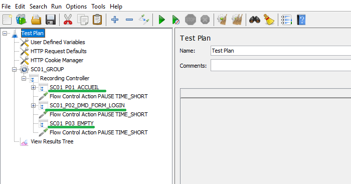

# Blog post in English for site https://elastic.co/en/blog

## The advantages of ELK APM for observing the tested environment
My first use of the Elastic Search Application Performance Monitoring (ELK APM) observability solution coincides with projects that are developed based on micro-services. In 2019 for the projects on which I was responsible for performance testing.

At this time (2019) the first versions of ELK APM were released.
I was attracted by easy installation of agents, the numerous protocols supported by the Java agent (https://www.elastic.co/guide/en/apm/agent/java/current/supported-technologies-details.html) including the Apache HttpClient used in JMeter and other languages (GO, .Net, Node.js, PHP, Python, Ruby), the dashboards quality in Kibana for the APM.

I found the information displayed in the Kibana APM dashboards to be relevant and not too verbose. The Java agent monitoring is simple but displays essential information on machine OS and JVM. 

The open-source aspect and the free solution for the main functions of the tool were also decisive.

I generalized the use of the ELK APM observability solution in performance environments for all projects. 

With ELK APM, I have the timelines of the different calls and exchanges between web services, the SQL queries executed, the exchange of messages by JMS file and monitoring. 

I also have quick access to errors or exceptions thrown in Java applications.

## Why integrated ELK APM in Apache JMeter
By adding Java APM agents to web applications, we find the services called timelines in the Kibana dashboards. However, we remain at a REST API call level mainly, we do not have the notion of page.

For example, page PAGE01 will make the following API calls:
<pre>
/rest/service1
/rest/service2
/rest/service3
</pre>

Another page PAGE02 will make following calls:
<pre>
/rest/service2
/rest/service4
/rest/service5
/rest/service6
</pre>

A 3rd page PAGE03 will make the following calls:
<pre>
/rest/service1
/rest/service2
/rest/service4
</pre>

In this example service2 is called in 3 different pages and service4 in 2 pages.
If we look in the Kibana dashboard for service2, we will find the union of the calls of the 3 calls corresponding to the 3 pages but we do not have the notion of page.

We cannot answer “In this page, what is the breakdown of time in the different REST calls called” because for a user of the application the notion of page response time is important.

The goal of the jmeter-elk-apm tool is to add the notion of an existing page in JMeter in the  Transaction Controller and start the observability in JMeter by creating an APM transaction and propagating this transaction identifier (traceparent) with the ELK agent to http REST request to web services because the APM agent recognizes the Apache httpclient library and can instrument it.

In the http request, the apm agent will add the identifier of the apm transaction to the header of the http request. The headers added are traceparent and elastic-apm-traceparent.

In Kibana dashboards, jmeter service transactions correspond to JMeter Transaction Controller pages. Transactions associated with pages are prefixed here with “TR_”.

We start from the notion of page in JMeter (Transaction Controller) to go to the http calls of the Web application (gestdoc) hosted in Tomcat.

In the case of an application composed into multi web services, we will see in the timeline, the different web services called in http(s) or jms and the time spent in each web service.

Example of technical architecture for a performance test with Apache JMeter and ELK APM Agent to test a web application hosted in Apache Tomcat.

## How the jmeter-elk-apm tool works
jmeter-elk-apm adds groovy code before a JMeter Transaction Controller to create an APM transaction before a page. 

In the JMeter Transaction Controller we find http samplers which make REST http(s) calls to the services, the ELK agent automatically adds a new traceparent header containing the identifier of the APM transaction because it recognizes the Apache HttpClient of the http sampler.

The groovy code terminates the APM transaction to indicate the end of the page.

The jmeter-elk-apm tool automates the addition of groovy code before the JMeter Transaction Controller and after the JMeter Transaction Controller.

The jmeter-elk-apm tool is an open source on Github  at the url: https://github.com/vdaburon/jmeter-elk-apm

This JMeter script is simple with 3 pages in 3 JMeter Transaction Controllers.

After launching the jmeter-elk-apm action ADD tool, the JMeter Transaction Controllers are surrounded by groovy code to create an APM transaction before the JMeter Transaction Controller and close the APM transaction after the JMeter Transaction Controller.

In the “groovy begin apm” sampler, the groovy code calls the ElasticApm API (simplified version):
<pre>
Transaction transaction = ElasticApm.startTransaction();
Scope scope = transaction.activate();
transaction.setName(transactionName); // contains JMeter Transaction Controller Name
</pre>

In the “groovy end apm” sampler, the groovy code calls the ElasticApm API (simplified version):
<pre>
transaction.end();
</pre>

## Configuring Apache JMeter with the ELK APM agent and the apm library
### Start Apache JMeter with ELK APM agent and ELK APM api library
### Declare the elastic apm agent
Url to find the apm agent : https://mvnrepository.com/artifact/co.elastic.apm/elastic-apm-agent

Add the ELK apm agent somewhere in the filesystem (could be in the &lt;JMETER_HOME&gt;\lib but not mandatory)

In &lt;JMETER_HOME&gt;\bin modify the jmeter.bat or setenv.bat

Add ELK APM configuration likes :
<pre>
set APM_SERVICE_NAME=yourServiceName
set APM_ENVIRONMENT=yourEnvironment
set APM_SERVER_URL=http://apm_host:8200

set JVM_ARGS=-javaagent:&lt;PATH_TO_AGENT_APM_JAR&gt;\elastic-apm-agent-&lt;version&gt;.jar -Delastic.apm.service_name=%APM_SERVICE_NAME% -Delastic.apm.environment=%APM_ENVIRONMENT% -Delastic.apm.server_urls=%APM_SERVER_URL%
</pre>

### Add the elastic apm library
Add the ELK apm api library in the &lt;JMETER_HOME&gt;\lib\apm-agent-api-&lt;version&gt;.jar

This library is use by JSR223 groovy code.

Url to find the apm library : https://mvnrepository.com/artifact/co.elastic.apm/apm-agent-api

## Recommendations on the impact of adding ELK APM in JMeter
The APM agent will intercept and modify all http sampler calls and this information will be stored in Elastic Search. 

It is preferable to voluntarily disable the http request of static elements (images, css, JavaScript, fonts) which can generate a large number of requests but which are not very useful in analyzing the timeline.

In the case of heavy load testing, it is recommended to change the <code>elastic.apm.transaction_sample_rate</code> parameter to only take part of the calls so as not to saturate the APM Server and Elastic Search.

This <code>elastic.apm.transaction_sample_rate</code> parameter can be declared in &lt;JMETER_HOME&gt;\jmeter.bat or setenv.bat but also in a JSR223 sampler with a short groovy code in a setUp Thread Group.

Groovy code records only 50% samples:

<pre>
import co.elastic.apm.api.ElasticApm;

// update elastic.apm.transaction_sample_rate
ElasticApm.setConfig("transaction_sample_rate","0.5");
</pre>

## Conclusion
The jmeter-elk-apm tool allows you to easily integrate the ELK APM observability solution into JMeter and add the notion of page in the timelines of Kibana APM dashboards.

ELK APM + JMeter is an excellent solution for understanding how the environment works during a performance test with simple monitoring, quality dashboards, time breakdown timelines in the different distributed application layers, display of exceptions lifted in web services.

Over time, the ELK APM solution gets better, I strongly recommend it of course in a performance testing context but it also has many advantages in the context of a development environment used for developers or integration used by functional or technical testers.

## About Vincent DABURON
- I’m a developer (java since 1996), a technical architect, I made performance tests since 1999.
- I’m an expert in the performance testing tools LoadRunner (since 1999) and Apache JMeter (since 2004).
- I have been giving web conferences and training since 2004 for internal colleagues in the large information technology consulting company.
- I have been a user and fan of the ELK APM solution since 2019.
- I have created several plugins for Apache JMeter available on the jmeter-plugins.org website or on github (https://github.com/vdaburon)
- My linkedIn : https://www.linkedin.com/in/daburon-vincent-b658131/